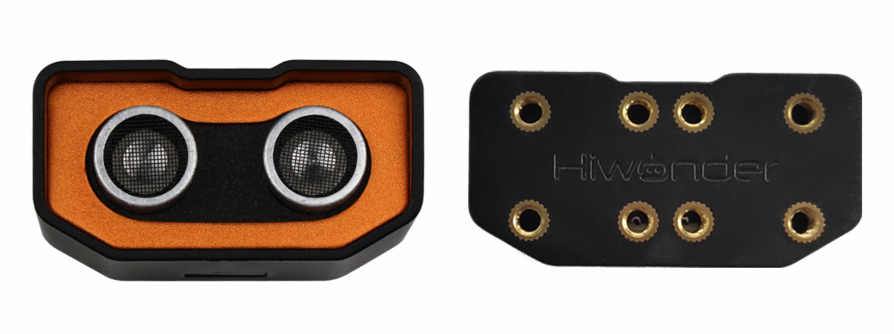
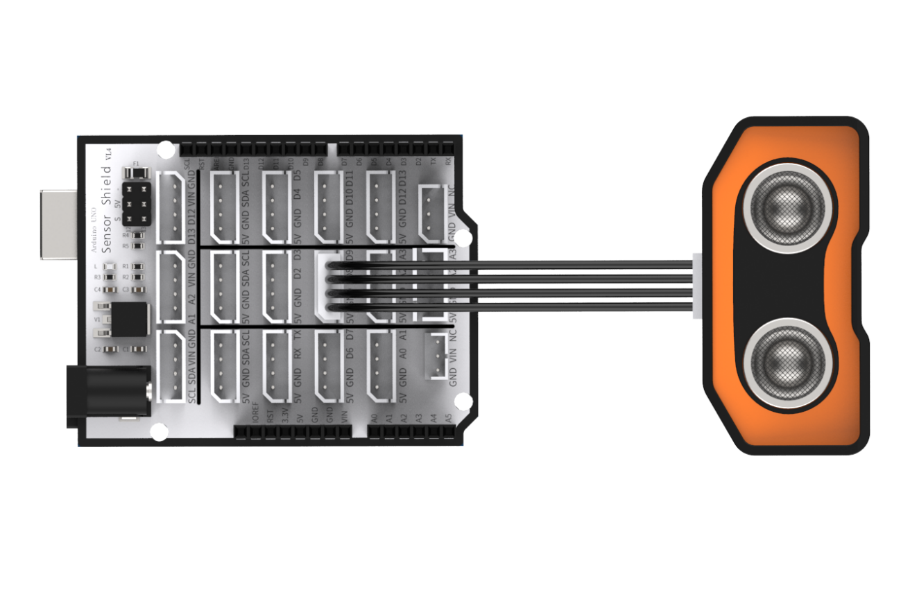
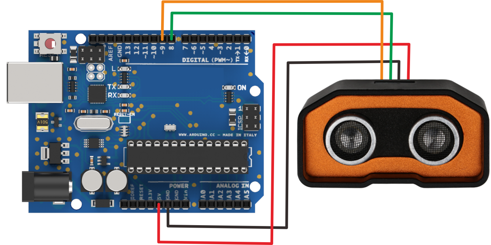
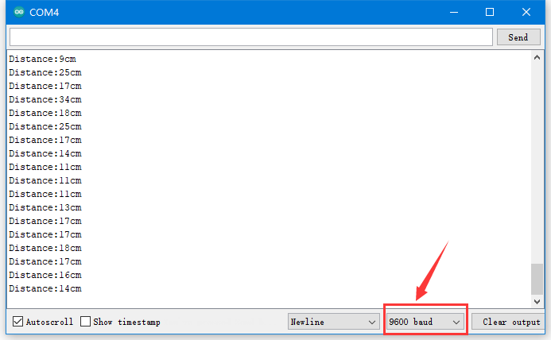

# 1. Ultrasonic Sensor



## 1.1 Product Introduction

Hiwonder ultrasonic sensor for distance measurement mainly includes an ultrasonic distance measurement chip which integrates ultrasonic transmitter circuit, ultrasonic receiver circuit, digital processing circuit, etc.

This module uses I/O to trigger distance measurement. The principle of distance measurement is that one of controlling ports transmits a10μs high level to trigger module to transmit eight 406hz square waves and then detect whether there is returned signal. If signal returns, module will output high level. The duration of high level is equivalent to the time ultrasonic wave used on from transmitting to receiving. The transmission speed of square wave is 346M/S the same as that of sound module. It takes 28.9μs for square wave to transmit 1 cm.

**Formula: Distance (cm)= Duration time of high level signal(μs)/58(μs/cm)**

For user-friendly connection, sensor comes with tapped hole so that it can be fixed on other devices with M4 screw. It is widely applicable in smart car and robot automatic obstacle avoidance.

## 1.2 Specification Instruction

### 1.2.1 Specification

| Working Voltage | DC 5V |
|:--:|:--:|
| Working Current | 15mA |
| Working Frequency | 40kHz |
| Effective Measurement Distance | 2cm～400cm |
| Measurement Angle | 15° |
| Input Trigger Signal | 10μs TTL pulses |
| Output Echo Signal | Output TTL level signal which is proportional to distance. |
| Port Type | The distance between 4pin is 2.54MM [Pin header](https://context.reverso.net/%E7%BF%BB%E8%AF%91/%E8%8B%B1%E8%AF%AD-%E4%B8%AD%E6%96%87/Pin+header) |
| Size | 60mm\*30mm |

## 1.3 Project

Using sensor with Arduino UNO to help you get quick experience.

### 1.3.1 Preparation

① Arduino UNO board \*1

② Expansion Board compatible with Arduino UNO Controller \*1

③ Ultrasonic module \*1

④ USB Cable \*1

⑤ 4PIN Wire \*1

### 1.3.2 Wiring Diagram

Take connecting 4PIN wire to D8 and D9 port on Arduino expansion board as example.



Please note that if not using Arduino expansion board, you need to connect sensor to Arduino demo board through Dupont line as following.



### 1.3.3 Project Process 

Step 1: Download and install Arduino IDE on your computer.

Step 2：Connect glowing ultrasonic module to corresponding port on Arduino UNO board with four Male-to-female Dupont lines as the picture shown above.

Step 3: Connect Arduino UNO demo board to computer with USB cable. After opening Arduino IDE, please paste "**[1.3.5 Sample code](#anchor_1_3_5)**" in "**File/New**".

Step 4: Select suitable demo board and port, then compile and upload the program.

Step 5: After the code is uploaded successfully, please open the serial monitor to set the baud rate to 9600.

### 1.3.4 Project Outcome

The serial monitor displays distance from ultrasonic to obstacle. The unit of distance is cm.



<p id="anchor_1_3_5"></p>

### 1.3.5 Example Code

```
/********Ultrasonic Sensor Testing Program*******
 * Arduino Type：Arduino UNO
 **************************/
int inputPin=9; // define ultrasonic signal receiver pin ECHO to D9 
int outputPin=8; // define ultrasonic signal transmitter pin TRIG to D8
 void setup()

{
Serial.begin(9600); 
pinMode(inputPin, INPUT); 
pinMode(outputPin, OUTPUT);
}

void loop()
{
digitalWrite(outputPin, LOW); 
delayMicroseconds(2);
digitalWrite(outputPin, HIGH); // Pulse for 10μs to trigger ultrasonic detection
delayMicroseconds(10); 
digitalWrite(outputPin, LOW);
int distance = pulseIn(inputPin, HIGH); // Read receiver pulse time 
distance= distance/58; // Transform pulse time to distance 
Serial.print("Distance:"); 
Serial.print(distance); //Output distance
Serial.println("cm"); 
delay(50);
}
```

## 1.4 Q&A

Q1: Why ultrasonic module failed to display after uploading?

A: Please check the wiring. Signal terminal of the module need to be connected to D4 and D5 port.

Q2: Are there any other details should be paid attention to during testing?

> [!NOTE]
>
> * This module should not be connected with electricity. If want to connect with electricity, please connect the GND terminal of module first, otherwise it will affect module normal operation.
>
> * When measure distance, the detected object area should not less than 0.5 square meters and ground should be as flat as possible, otherwise measurement result will be affected.